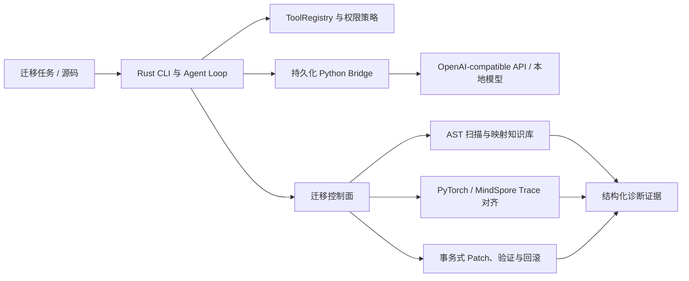

# candle-cli 项目综述与简历证据

## 一句话定位

`candle-cli` 是一款面向 **PyTorch→MindSpore 工程迁移**的 Rust-first Agentic CLI：通过静态 API 扫描、官方映射知识库、双框架执行轨迹对齐和事务式修复闭环，帮助开发者定位 dtype、shape、返回结构、数值和运行时错误的首个语义偏差，并生成可验证、可回滚的迁移补丁。

这句话比“基于 Rust 的 Agentic CLI”更准确，因为它先说明解决的工程问题，再说明实现形态。

## 项目由来与技术演进

项目源于 MindSpore 迁移中的真实痛点：把 PyTorch 示例机械替换为 MindSpore API 后，代码可能继续运行，但中间张量已经发生 dtype、shape、返回结构或默认语义变化，最终报错位置往往不是根因；缺失算子和行为差异也难以仅靠异常栈定位。

最初方案希望用 Rust Candle 承载本地模型推理，因此保留了 `CandleTargetRuntime` 运行时抽象。后续根据迭代效率把实际模型接入切换为持久化 Python Bridge：Rust 负责 CLI、Agent Loop、工具、权限和迁移控制面，Python 负责 OpenAI-compatible API、本地 Transformers 与迁移分析执行面。当前可配置运行时是 Mock 和 Bridge；`CandleRuntime` 仍是未实现的接口占位，简历中不应写成已完成的第三种后端。

## 当前可复现数据

| 能力 | 数据 | 适用边界 |
|---|---:|---|
| AST 扫描器固定开发集 | 50/50 任务完全匹配，Precision/Recall 均为 100% | 仓库内公开合成语法集，不代表未知项目总体准确率 |
| 真实开发语料扫描 | 25/25 文件成功；244/545 调用有映射，覆盖率 44.77% | PyTorch Examples、nanoGPT、DETR；静态覆盖率 |
| 冻结规则后的留出项目 | 17/17 文件成功；89/212 调用有映射，覆盖率 41.98% | Segment Anything 固定提交；静态覆盖率 |
| 确定性改写 | 开发语料 115 个、留出语料 45 个 exact-only 改写机会；18/18 与 9/9 预览文件语法有效 | 语法有效不等于 MindSpore 运行正确 |
| 首个偏差定位 | 10/10 等价性分类正确；8/8 缺陷类型及首个偏差 Top-1 正确 | 仓库内 10 个固定合成缺陷注入场景 |
| 组件级双框架验证 | 7/7 分类正确；4/4 等价组件通过；3/3 留出偏差首错 Top-1；梯度 1/1 一致 | MLP、CNN、梯度、BatchNorm 与固定缺陷；不是端到端项目准确率 |
| 训练步级双框架验证 | 3/3 案例通过；2/2 等价训练步骤通过；1/1 学习率注入缺陷在优化器更新阶段首错 Top-1 正确 | 单步 SGD、MSE loss 与参数快照；不覆盖多步收敛 |
| 端到端迁移工作流 | 4/4 固定场景通过；1/1 真实双框架应用验证；2/2 故障完整回滚；1/1 dtype 首错 Top-1 | 两算子程序与已标注故障；证明控制流和恢复，不代表项目迁移准确率 |
| 安全回归 | 12/12 攻击样例被硬拦截或进入确认门禁；10/10 正常样例放行 | 当前路径/权限回归集，不覆盖未知攻击 |
| 上下文裁切 | 估算 Token 4,434→1,395，减少 68.54%；系统消息与工具链完整 | 启发式估算，不是 Provider 计费 Token |
| Provider 缓存 | Bridge 已支持采集并设置完整性门禁；已发布基准仍为 `null` | 尚未固定真实 Provider 请求集，不能声称具体缓存命中率 |
| 当前全量测试 | Rust 146/146；Python 313/313 | Linux 隔离测试目录；双框架组件、训练步与端到端工作流已真实验收 |

机器可读结果和完整限制分别位于 `benchmarks/results`、`docs/M6_REAL_PROJECT_RESULTS.md`、`docs/M7_RUNTIME_PARITY.md`、`docs/M8_SECURITY_BENCHMARK.md`、`docs/M9_CONTEXT_BENCHMARK.md`、`docs/M11_COMPONENT_PARITY.md`、`docs/M12_TRAINING_PARITY.md` 与 `docs/M13_END_TO_END_WORKFLOW.md`。

## 推荐简历版本

### 项目标题

**candle-cli：面向 PyTorch→MindSpore 迁移的可验证 Agentic CLI（Rust / Python）**

### 项目简介

针对框架迁移中 API 可替换但运行语义不一致、最终异常难以定位根因的问题，开发 Rust-first 智能迁移 CLI，通过统一命令打通“静态扫描 → 官方映射 → 事务式改写 → 程序验证 → 双框架 Trace 对齐 → 首错诊断 → 自动回滚”的证据闭环。

### 建议保留的四条经历

- **迁移诊断闭环：** 基于 Python AST 构建不执行目标代码的 PyTorch API 扫描器，并以版本化 Schema 串联 MindSpore 官方映射、dtype/shape/返回结构/数值/梯度/优化器更新 Trace 与首个偏差诊断；在 Linux 的 PyTorch 2.6/MindSpore 2.9 环境完成 MLP、CNN、梯度、BatchNorm 和单步 SGD 训练等固定案例双端采集，实现 7/7 组件分类正确、4/4 等价组件通过、3/3 组件留出偏差首错 Top-1 正确，以及 2/2 等价训练步骤和 1/1 学习率注入缺陷定位正确。
- **真实项目与安全修复：** 在 PyTorch Examples、nanoGPT、DETR 共 25 个文件、4,436 行真实代码上将调用映射覆盖率由 24.22% 提升至 44.77%，冻结规则后在 Segment Anything 留出集达到 41.98%；实现 `migrate run` 统一状态机串联扫描、Patch、验证、Trace 比较与回滚，在 PyTorch 2.6/MindSpore 2.9 的 4/4 固定闭环场景中实现 1/1 真实应用验证、2/2 故障源码完整恢复和 1/1 dtype 首错 Top-1。
- **Rust/Python Agent 架构：** 使用 Rust trait 隔离运行时，Rust 负责 Agent Loop、工具注册、权限和结构化协议，持久化 Python JSONL Worker 负责 OpenAI-compatible API/本地模型与迁移分析；支持工具调用纠错、子 Agent 三步有界只读委派、超时控制和会话级运行时复用。
- **安全、上下文与评测工程：** 将路径边界和权限决策放在工具执行层，固定回归集 12/12 攻击样例被拦截或门禁、10/10 正常样例放行；按完整用户轮次裁切上下文，在四类确定性会话中将估算 Token 减少 68.54% 并保持工具调用链完整，所有指标以版本化清单、机器可读结果和自动化防漂移测试固化。

如果简历空间有限，优先保留前两条，再从后两条中选择一条与目标岗位最相关的内容。

## 面试时应主动说明的边界

- 不把 `CandleRuntime` 描述为已实现；当前生产可用路径是 Rust + Python Bridge。
- 不把合成集的 100% 写成“真实项目迁移准确率 100%”。
- 不把 Patch 语法有效率写成 MindSpore 运行成功率。
- 不把 68.54% 上下文裁切率写成缓存命中率或实际账单节省率。
- 不把当前 12 个安全样例的结果外推为“可防御所有攻击”。
- 不把 PyTorch 2.6/MindSpore 2.9 的 5 个基础 API 链 100% 一致率外推为真实项目端到端迁移准确率。
- 不把 7 个组件/固定缺陷的 100% 分类与 Top-1 写成未知项目泛化准确率；其中两个案例是明确标注的故障注入。
- 不把 3 个单步训练案例写成训练收敛或真实项目迁移准确率；其中一个案例是明确标注的学习率故障注入。
- 不把 4 个端到端工作流场景写成真实项目迁移成功率；其中可执行程序仅有两个算子，两个失败案例是明确标注的故障注入。

这些限定不会降低项目含金量，反而说明评测口径、数据泄漏和工程证据意识是设计的一部分。

## 下一轮最有价值的开发

1. **真实项目闭环迁移：** 从公开项目冻结一个可执行模型切片，让 `migrate run` 自动启动两套框架采集、比较中间 Trace，并统计需要人工处理的剩余 API、Patch 采用率和最终验证通过率。
2. **数据流水线与随机性：** 增加 Normalize/ToTensor/DataLoader 布局与类型差异，并用统计检验评估 Dropout、初始化和采样，而不是要求随机张量逐元素相同。
3. **Graph Mode 与真实网络切片：** 增加 PYNATIVE/Graph 编译差异，并从公开模型冻结小型训练与推理切片作为新的外部留出集。
4. **自动 Trace 采集：** 为统一工作流增加 PyTorch/MindSpore 两套采集命令模板和隔离环境配置，消除当前手工提供 JSONL 的步骤。
5. **升级上下文系统：** 从直接丢弃旧轮次升级为“近期原文 + 结构化任务状态 + 可验证摘要”，同时评测 Token、任务成功率和事实保留率。
6. **运行真实 Token/Cache 评测：** Bridge 已能聚合 input/output/cached input tokens；下一步固定 Provider、模型、请求集和价格日期，补充请求延迟、重试率、成本与缓存指标。
7. **扩展安全留出集：** 覆盖符号链接竞态、Windows junction、压缩包逃逸、命令/提示注入、网络外传和资源耗尽，并把开发规则集与留出攻击集分离。

完成统一迁移闭环后，项目已经能用同一命令生成可验证、可回滚的迁移报告；下一步应把这套状态机应用到外部真实模型切片，并自动完成双框架 Trace 采集，而不是继续堆叠合成算子案例。
