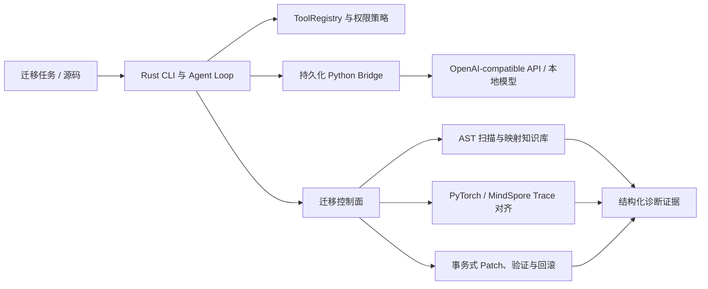

# candle-cli 项目综述与简历证据

## 一句话定位

`candle-cli` 是一款面向 **PyTorch→MindSpore 工程迁移**的 Rust-first Agentic CLI：通过静态 API 扫描、官方映射知识库、双框架执行轨迹对齐和事务式修复闭环，帮助开发者定位 dtype、shape、返回结构、数值和运行时错误的首个语义偏差，并生成可验证、可回滚的迁移补丁。

这句话比“基于 Rust 的 Agentic CLI”更准确，因为它先说明解决的工程问题，再说明实现形态。

## 当前工程状态

截至当前候选版本，项目已完成 M0–M18 路线中的主要功能闭环：静态扫描、证据映射、事务式改写、双框架 Trace 对齐、训练/数据/Graph 诊断、安全留出集、上下文事实保留、doctor、安装脚本、演示脚本、最终证据聚合和跨平台 CI 配置。PR #7 已通过 GitHub Actions 中的 Python 3.10、Python 3.12、Ubuntu Rust、Windows Rust 以及 schema/benchmark integrity 检查；仓库仍待合并该 PR，并由用户决定是否创建正式版本 tag 与 GitHub Release。

尚未完成、也不应写成已完成的数据是：真实 Provider Token/Cache 命中率、正式单/多 Agent 配对收益，以及 Candle 本地推理后端的生产可用实现。

## 项目由来与技术演进

项目源于 MindSpore 迁移中的真实痛点：把 PyTorch 示例机械替换为 MindSpore API 后，代码可能继续运行，但中间张量已经发生 dtype、shape、返回结构或默认语义变化，最终报错位置往往不是根因；缺失算子和行为差异也难以仅靠异常栈定位。

最初方案希望用 Rust Candle 承载本地模型推理，因此保留了 `CandleTargetRuntime` 运行时抽象。后续根据迭代效率把实际模型接入切换为持久化 Python Bridge：Rust 负责 CLI、Agent Loop、工具、权限和迁移控制面，Python 负责 OpenAI-compatible API、本地 Transformers 与迁移分析执行面。当前可配置运行时是 Mock 和 Bridge；`CandleRuntime` 仍是未实现的接口占位，简历中不应写成已完成的第三种后端。

## 当前可复现数据

| 能力 | 数据 | 适用边界 |
|---|---:|---|
| AST 扫描器固定开发集 | 50/50 任务完全匹配，Precision/Recall 均为 100% | 仓库内公开合成语法集，不代表未知项目总体准确率 |
| 真实开发语料扫描 | 25/25 文件成功；244/545 调用有映射，覆盖率 44.77% | PyTorch Examples、nanoGPT、DETR；静态覆盖率 |
| 冻结规则后的留出项目 | 17/17 文件成功；89/212 调用有映射，覆盖率 41.98% | Segment Anything 固定提交；静态覆盖率 |
| 确定性改写 | 开发语料 115 个、留出语料 45 个 exact-only 改写机会；18/18 与 9/9 预览文件语法有效 | 语法有效不等于 MindSpore 运行正确 |
| 首个偏差定位 | 10/10 等价性分类正确；8/8 缺陷类型及首个偏差 Top-1 正确 | 仓库内 10 个固定合成缺陷注入场景 |
| 组件级双框架验证 | 7/7 分类正确；4/4 等价组件通过；3/3 留出偏差首错 Top-1；梯度 1/1 一致 | MLP、CNN、梯度、BatchNorm 与固定缺陷；不是端到端项目准确率 |
| 训练步级双框架验证 | 3/3 案例通过；2/2 等价训练步骤通过；1/1 学习率注入缺陷在优化器更新阶段首错 Top-1 正确 | 单步 SGD、MSE loss 与参数快照；不覆盖多步收敛 |
| 端到端迁移工作流 | 4/4 固定场景通过；1/1 真实双框架应用验证；2/2 故障完整回滚；1/1 dtype 首错 Top-1 | 两算子程序与已标注故障；证明控制流和恢复，不代表项目迁移准确率 |
| 真实模型自动双运行时 | PyTorch Examples MNIST 分类器头 3/3 场景通过；1/1 等价迁移；2/2 字节级回滚；自动 Patch 6/7 | 25 行离线切片，不是完整 141 行程序或未知项目成功率 |
| 数据流水线与随机性 | 18/18 真实双框架案例；8/8 故障类别与首差异 Top-1；7/7 确定性、3/3 统计等价 | 固定小型数组与故障注入；随机案例 128–4096 样本，不代表未知分布 |
| Graph 与高级训练状态 | 13/13 分类正确；4/4 三模式组件；2/3 多步优化器等价并定位 1 个真实 AdamW 差异；3/3 跨进程 Checkpoint 恢复 | CPU 小网络、3–5 步短轨迹；不代表完整收敛或加速卡结果 |
| 安全回归与冻结留出 | M8 开发集 12/12 攻击被拦截/门禁、10/10 正常放行；M18 Linux 留出集 12/12 可评估攻击被拦截/门禁、8/8 正常项无误拦 | M18 共 15 个攻击项，压缩包入口、symlink 竞态和 Windows junction 三项明确不适用且不计入分母；不代表未知攻击防御率 |
| 上下文事实保留 | 20/20 文件/命令/错误/待办/决策事实保留；20/20 历史事实任务可回答；估算 Token 23,146→4,221，减少 81.76% | 冻结确定性会话与启发式 Token，不是 Provider 计费数据或未知会话泛化率 |
| Provider 缓存 | Bridge 已支持采集并设置完整性门禁；已发布基准仍为 `null` | 尚未固定真实 Provider 请求集，不能声称具体缓存命中率 |
| 当前全量测试 | Rust 177/177；Python 350/350；Clippy `-D warnings` 通过；PR #7 的 Python 3.10/3.12、Ubuntu Rust、Windows Rust、schema/benchmark integrity 全部通过 | Linux 隔离测试目录与 `zgr` Python；GitHub Actions 结果来自当前 PR 候选分支，仍待合并进入 main |

机器可读结果和完整限制分别位于 `benchmarks/results`、`docs/M6_REAL_PROJECT_RESULTS.md`、`docs/M7_RUNTIME_PARITY.md`、`docs/M8_SECURITY_BENCHMARK.md`、`docs/M9_CONTEXT_BENCHMARK.md`、`docs/M11_COMPONENT_PARITY.md`、`docs/M12_TRAINING_PARITY.md`、`docs/M13_END_TO_END_WORKFLOW.md`、`docs/M14_REAL_MODEL_DUAL_RUNTIME.md`、`docs/M15_DATA_PIPELINE_RANDOMNESS.md`、`docs/M16_GRAPH_ADVANCED_TRAINING.md`、`docs/M17_CONTEXT_AGENT_ABLATION.md`、`docs/M18_RELEASE_SECURITY_CI.md` 与 `docs/FINAL_BENCHMARK_REPORT_CN.md`。

## 推荐简历版本

### 项目标题

**candle-cli：面向 PyTorch→MindSpore 迁移的可验证 Agentic CLI（Rust / Python）**

### 项目简介

针对框架迁移中 API 可替换但运行语义不一致、最终异常难以定位根因的问题，开发 Rust-first 智能迁移 CLI，通过统一命令打通“静态扫描 → 官方映射 → 事务式改写 → 程序验证 → 双框架 Trace 对齐 → 首错诊断 → 自动回滚”的证据闭环。

### 建议保留的四条经历

- **迁移诊断闭环：** 基于 Python AST 构建不执行目标代码的 PyTorch API 扫描器，以版本化 Schema 串联官方映射、dtype/shape/返回结构/数据流水线/梯度/优化器状态与首差异诊断；在 PyTorch 2.6/MindSpore 2.9 环境完成 18 个数据随机性案例和 13 个高级训练案例，数据故障 8/8、训练阶段故障 5/5 Top-1 正确，4/4 组件通过 PYNATIVE/GRAPH，并在 3–5 步轨迹中验证 2/3 优化器等价、定位 1 个真实 AdamW 状态差异及 3/3 跨进程恢复。
- **真实项目与安全修复：** 在 PyTorch Examples、nanoGPT、DETR 共 25 个文件、4,436 行真实代码上将调用映射覆盖率由 24.22% 提升至 44.77%，冻结规则后在 Segment Anything 留出集达到 41.98%；实现 `migrate run` 统一状态机串联扫描、Patch、验证、Trace 比较与回滚，并在 PyTorch Examples MNIST 分类器头完成 3/3 双运行时场景、1/1 等价迁移、2/2 字节级回滚和 6/7 自动 Patch。
- **Rust/Python Agent 架构：** 使用 Rust trait 隔离运行时，Rust 负责 Agent Loop、工具注册、权限和结构化协议，持久化 Python JSONL Worker 负责 OpenAI-compatible/Ollama 原生 API、本地模型与迁移分析；支持工具调用纠错、子 Agent 三步有界只读委派、主子 Agent 共享墙钟截止时间和会话级运行时复用。
- **安全、上下文与评测工程：** 将路径边界和权限决策放在工具执行层，修复递归 symlink 逃逸、web_search 命令拼接与无确认联网，并为 read/Shell 输出增加资源上限；M8 开发集 12/12、M18 Linux 留出集 12/12 可评估攻击均被拦截或门禁，正常项误拦截为 0/8，同时披露 3 个不适用项。构建“近期原文 + 结构化任务状态 + 可校验来源摘要”，在 20 个冻结迁移会话中保留 20/20 历史事实与可回答性，估算 Token 减少 81.76%。

如果简历空间有限，优先保留前两条，再从后两条中选择一条与目标岗位最相关的内容。

## 面试时应主动说明的边界

- 不把 `CandleRuntime` 描述为已实现；当前生产可用路径是 Rust + Python Bridge。
- 不把合成集的 100% 写成“真实项目迁移准确率 100%”。
- 不把 Patch 语法有效率写成 MindSpore 运行成功率。
- 不把 81.76% 启发式上下文压缩率写成缓存命中率、Provider Token 节省或实际账单节省率。
- 不把当前 12 个安全样例的结果外推为“可防御所有攻击”。
- 不把 PyTorch 2.6/MindSpore 2.9 的 5 个基础 API 链 100% 一致率外推为真实项目端到端迁移准确率。
- 不把 7 个组件/固定缺陷的 100% 分类与 Top-1 写成未知项目泛化准确率；其中两个案例是明确标注的故障注入。
- 不把 3 个单步训练案例写成训练收敛或真实项目迁移准确率；其中一个案例是明确标注的学习率故障注入。
- 不把 4 个端到端工作流场景写成真实项目迁移成功率；其中可执行程序仅有两个算子，两个失败案例是明确标注的故障注入。
- 不把 M14 的 25 行分类器头切片写成完整 MNIST 项目迁移成功率。
- 不把 M15 的 18 个固定案例写成未知数据流水线准确率；统计等价也不表示随机序列或 RNG 算法相同。
- 不把 M16 的 3–5 步小网络轨迹写成完整模型收敛；2/3 优化器等价率应与已定位的 AdamW 差异一起披露。

这些限定不会降低项目含金量，反而说明评测口径、数据泄漏和工程证据意识是设计的一部分。

## 合并 PR #7 后的建议动作

1. **同步 main 并创建候选发布版本：** 合并 PR #7 后同步本地和服务器代码，确认 README、README_CN、简历摘要、Changelog、安装脚本和 demo 脚本均指向同一组证据；随后由用户决定版本号、tag 与 GitHub Release。
2. **运行真实 Token/Cache 评测：** Bridge 已能聚合 input/output/cached input tokens，实验协议也已冻结；下一步选择 Provider、模型和价格日期，完成真实配对运行。完成前只能写“支持采集”，不能写具体缓存命中率。
3. **完成单/多 Agent 消融：** 共享预算机制和 10 个迁移任务已就绪，需在相同请求、工具和超时预算下完成三次重复，并判断是否存在可写入简历的稳定收益。
4. **继续拆解 AdamW 差异：** 对偏置修正、权重衰减、学习率序列和状态槽逐项消融，形成可执行迁移建议。

项目已经完成真实模型切片、数据流水线、Graph Mode、多步训练状态、安全留出集和确定性上下文事实保留的可审计验证。当前最优先动作不是继续堆功能，而是先合并 PR #7、同步 main、固定发布口径，再决定是否补真实 Provider Token/Cache 与单/多 Agent 配对实验。
